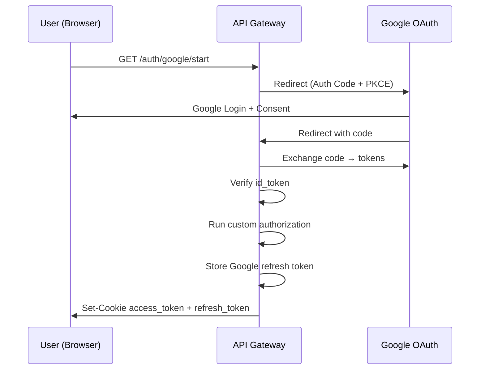
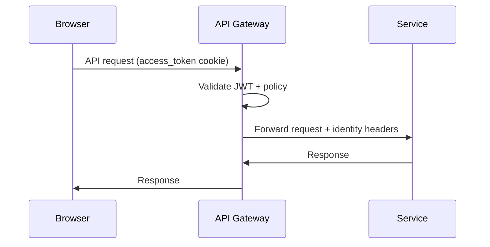
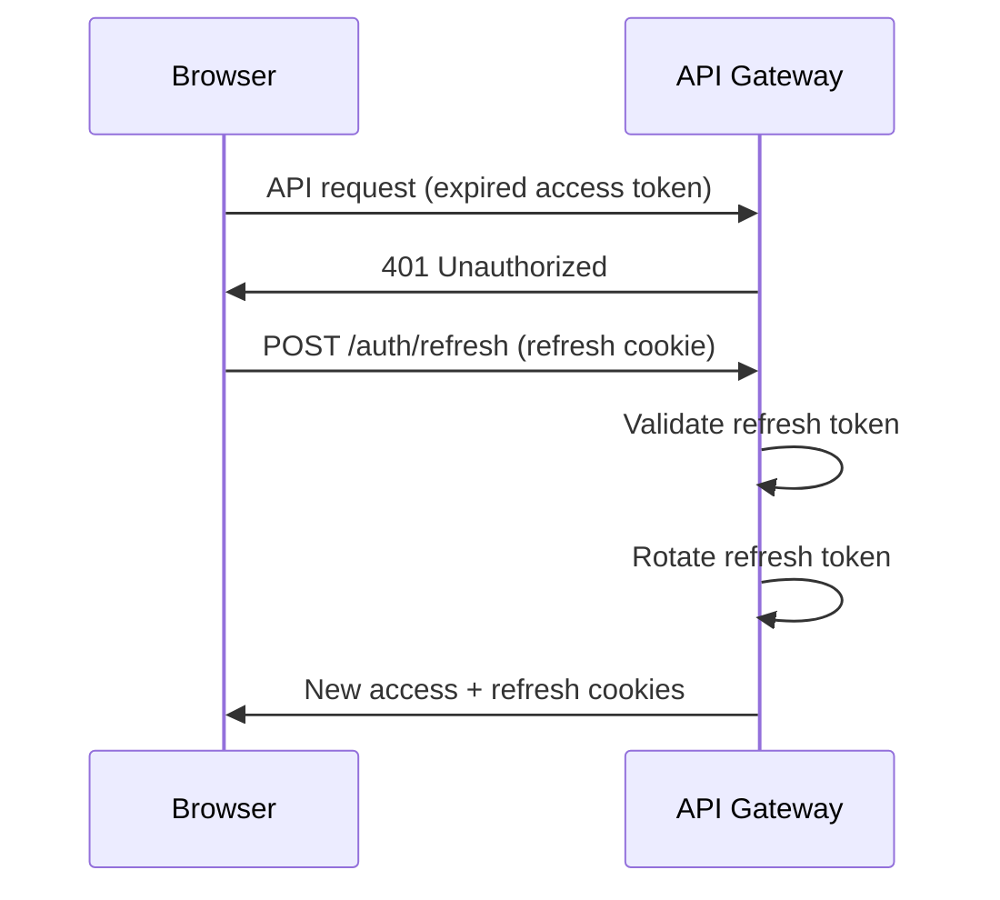
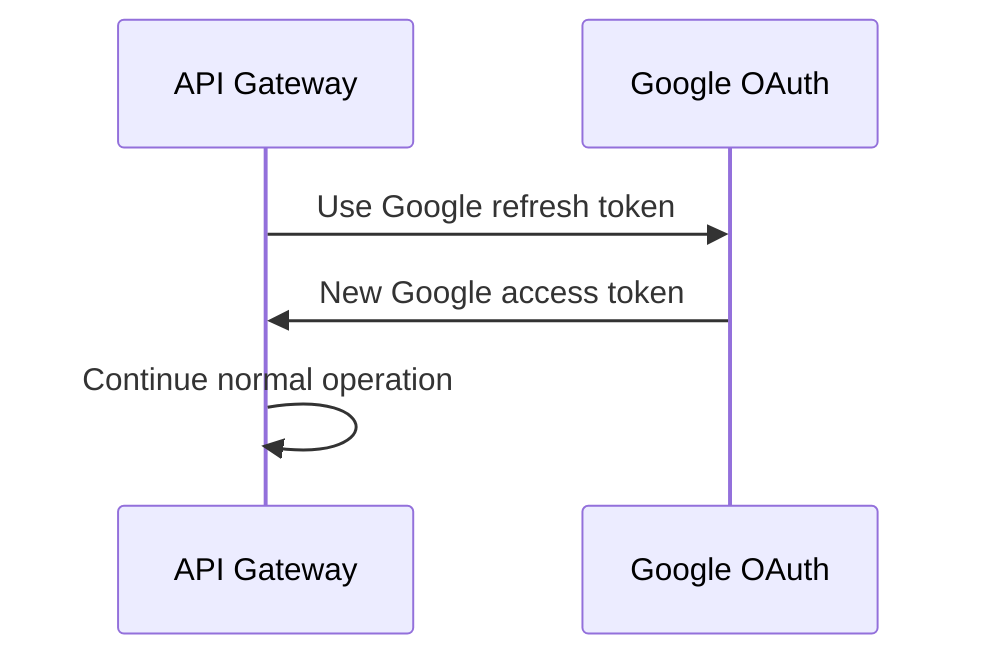
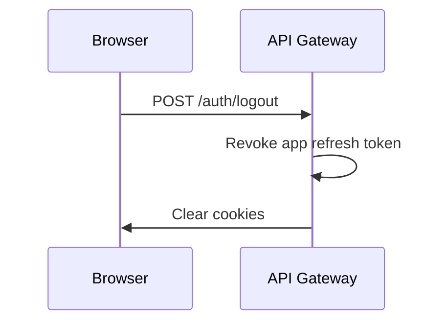
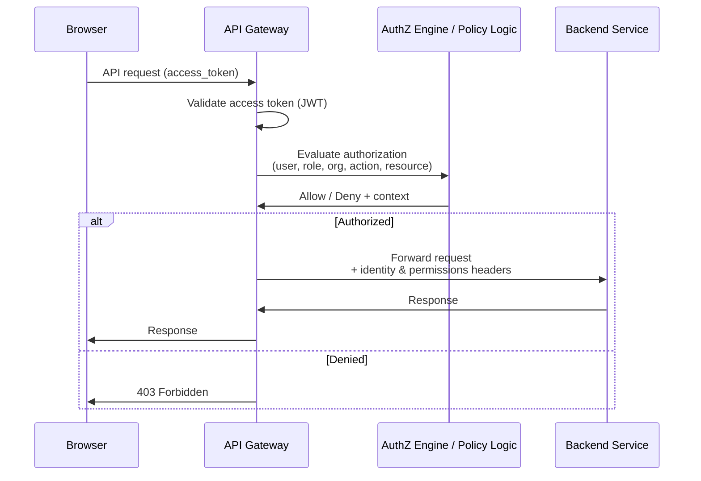
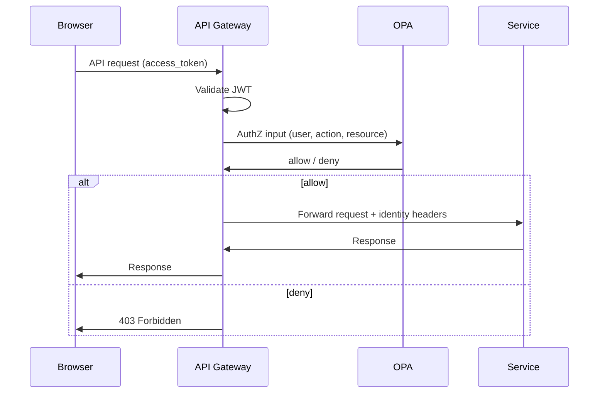

login:

```mermaid
sequenceDiagram
    participant U as User (Browser)
    participant G as API Gateway
    participant O as Google OAuth

    U->>G: GET /auth/google/start
    G->>O: Redirect (Auth Code + PKCE)
    O->>U: Google Login + Consent
    O->>G: Redirect with code
    G->>O: Exchange code → tokens
    G->>G: Verify id_token
    G->>G: Run custom authorization
    G->>G: Store Google refresh token
    G->>U: Set-Cookie access_token + refresh_token
```

request:

```mermaid
sequenceDiagram
    participant U as Browser
    participant G as API Gateway
    participant S as Service

    U->>G: API request (access_token cookie)
    G->>G: Validate JWT + policy
    G->>S: Forward request + identity headers
    S->>G: Response
    G->>U: Response
```

refresh:

```mermaid
sequenceDiagram
    participant U as Browser
    participant G as API Gateway

    U->>G: API request (expired access token)
    G->>U: 401 Unauthorized
    U->>G: POST /auth/refresh (refresh cookie)
    G->>G: Validate refresh token
    G->>G: Rotate refresh token
    G->>U: New access + refresh cookies
```

google refresh:

```mermaid`
sequenceDiagram
    participant G as API Gateway
    participant O as Google OAuth

    G->>O: Use Google refresh token
    O->>G: New Google access token
    G->>G: Continue normal operation
```

logout:

```mermaid
sequenceDiagram
    participant U as Browser
    participant G as API Gateway

    U->>G: POST /auth/logout
    G->>G: Revoke app refresh token
    G->>U: Clear cookies
```

authZ:

```mermaid
sequenceDiagram
    participant U as Browser
    participant G as API Gateway
    participant P as AuthZ Engine / Policy Logic
    participant S as Backend Service

    U->>G: API request (access_token)
    G->>G: Validate access token (JWT)
    G->>P: Evaluate authorization<br/>(user, role, org, action, resource)
    P->>G: Allow / Deny + context
    alt Authorized
        G->>S: Forward request<br/>+ identity & permissions headers
        S->>G: Response
        G->>U: Response
    else Denied
        G->>U: 403 Forbidden
    end
```

OPA authZ:

```mermaid
sequenceDiagram
    participant B as Browser
    participant G as API Gateway
    participant O as OPA
    participant S as Service

    B->>G: API request (access_token)
    G->>G: Validate JWT
    G->>O: AuthZ input (user, action, resource)
    O->>G: allow / deny
    alt allow
        G->>S: Forward request + identity headers
        S->>G: Response
        G->>B: Response
    else deny
        G->>B: 403 Forbidden
    end
```
---